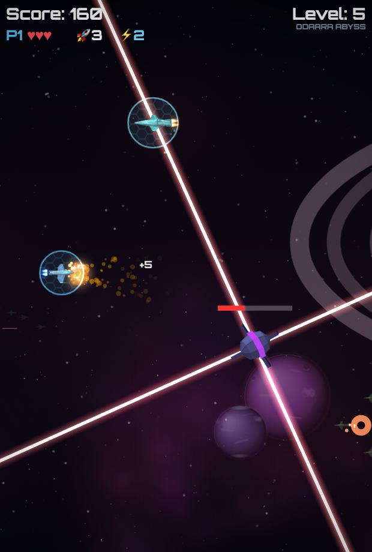
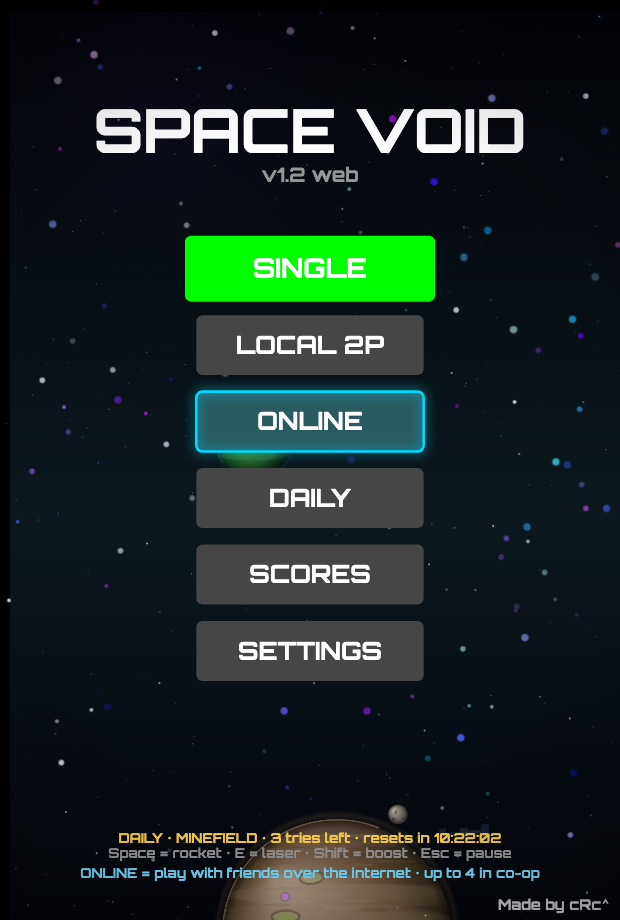
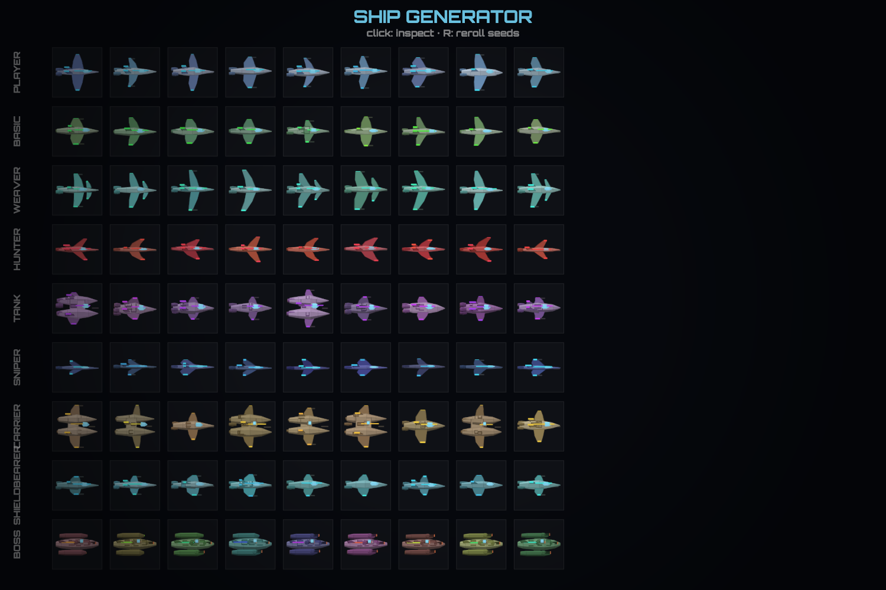

# SPACE VOID

Retro space shooter for the browser. **Every pixel of art is generated in code** — ships, bosses, planets, explosions, backgrounds, even the menu: the game ships zero image assets (only sounds are downloaded).

🎮 **Play now: https://space-void.vercel.app** — desktop or phone, installable as a PWA, works offline.

| Gameplay | Menu | Ship generator |
|---|---|---|
|  |  |  |

## Modes

- **SINGLE** — waves, elites, wedge formations, bosses every level, mega boss every 5th
- **LOCAL 2P** — co-op or versus on one keyboard / two gamepads
- **ONLINE** — up to 4 players co-op or 1v1 versus over WebRTC (P2P, host-authoritative)
- **DAILY** — seeded daily challenge with a global leaderboard, one modifier a day (BULLET HELL, MINEFIELD, CONVOY RAID…), 3 attempts

## What's inside

- **Procedural everything.** A ~300-line software 3D renderer (`mesh3d.js`) flat-shades low-poly meshes onto the 2D canvas. Ships come from a parts-based generator (hull/wings/fins/engines by family seed), bosses are assembled live from a hull plus turret modules that track players and blow off as health drops, planets/nebulae/backdrops are painted per level, and the hyperspace jump between levels swaps the whole scene at peak streak-speed.
- **Enemy roster:** basic, weaver, hunter, tank (rockets + mines at high levels), sniper (telegraphed rail shot), carrier (launches drones), shieldbearer (own hex bubble), elites (golden aura, guaranteed drop), wedge formations, falling wrecks that stay dangerous.
- **Bosses:** per-level generated dreadnoughts with fan/spiral/ring/wall volleys, aimed shots, homing-rocket salvos, straight and sweeping lasers, minion warps; every 3rd is a carrier, every 4th rams, every 5th is a **two-phase mega boss** whose hull blows away to reveal a rotating-beam core.
- **World:** a stream of unique planets (rings, moons, storms, city lights, orbital stations), comets that sometimes strike them, cargo freighters (a rare golden one rains power-ups when shot down), convoys fleeing pirates, ion storms that knock every weapon offline.
- **Feel:** positional stereo audio (WebAudio synth + panners), 3D debris on every kill, hex shields with impact ripples, combo-heated weapons, slow-mo boss kills, screen-shake, sector names, touch tutorial.

## Controls

**Desktop** — P1: `WASD` move, `Shift` boost, `Space` rocket, `E`/`Q` laser (guns auto-fire). P2 (local): arrows, `RShift`, `Enter`, `Numpad1`/`/`. Gamepads supported (stick/D-pad, `A`/`RT` rocket, `X` laser, `B`/`RB` boost). `Esc`/`P` pause.

**Touch** — drag anywhere to move, on-screen rocket & laser buttons, guns auto-fire.

## Run locally

Static site, no build step:

```bash
cd web
python3 -m http.server 8791
# open http://localhost:8791
```

Online modes need the Vercel API routes (`/api/rtc`, `/api/scores`) — use `vercel dev` for those; everything else works from any static server.

## Dev cheats (URL params)

`?mode=single|coop|versus|daily` skip the menu · `&god` invincible · `&ff=30000` fast-forward 30s · `&boss=N` instant boss of level N · `&ion` ion storm at 5s · `&mod=<id>` force a daily modifier (`minefield`, `rocketday`, `convoy`…) · `&bg=N` force a backdrop seed · `&prof` frame-time overlay · `?shipgen` procedural ship gallery (click to inspect, `R` rerolls).

## Repo layout

```
web/            the game (deployed to Vercel)
  js/mesh3d.js      software 3D renderer + sprite baking
  js/shipgen.js     parts-based ship generator (all families)
  js/bossgen.js     modular bosses + mega-boss core
  js/bggen.js       planets, backdrops, sector names
  js/procassets.js  builds the whole sprite set at boot
  js/entities.js    everything that moves
  js/game.js        single/coop/daily world
  js/versus*.js     versus (local + online)
  js/coop_online.js online co-op (host-authoritative snapshots)
  api/              Vercel functions: WebRTC signaling + leaderboards
*.py            the original pygame prototype (legacy, PNG-based)
```

Made by **cRc^** · procedural art & engine built with Claude
