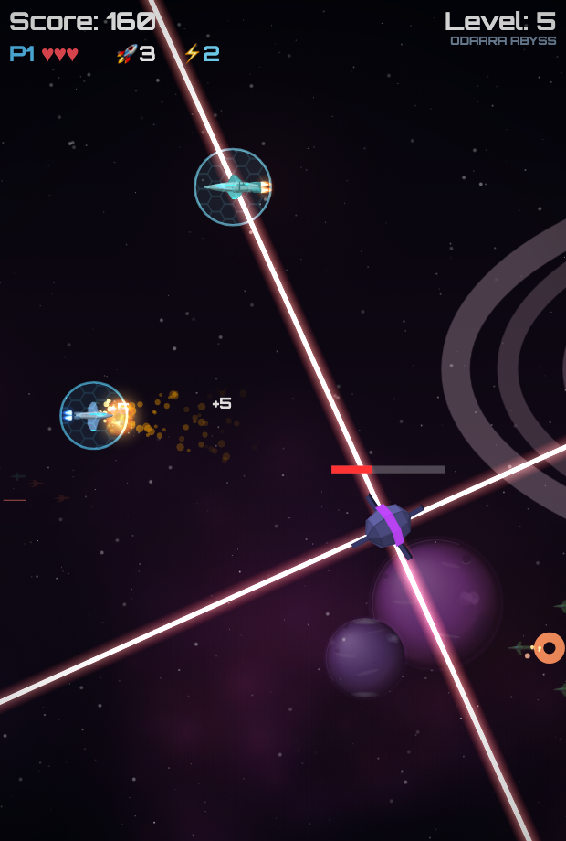
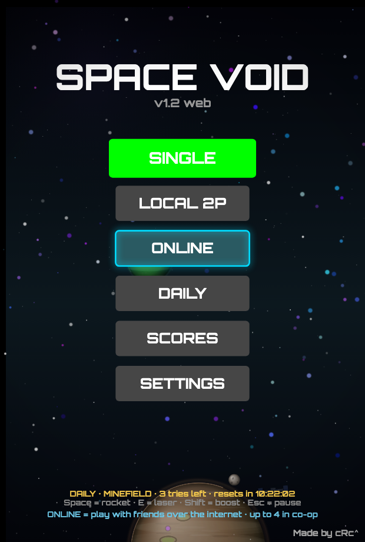
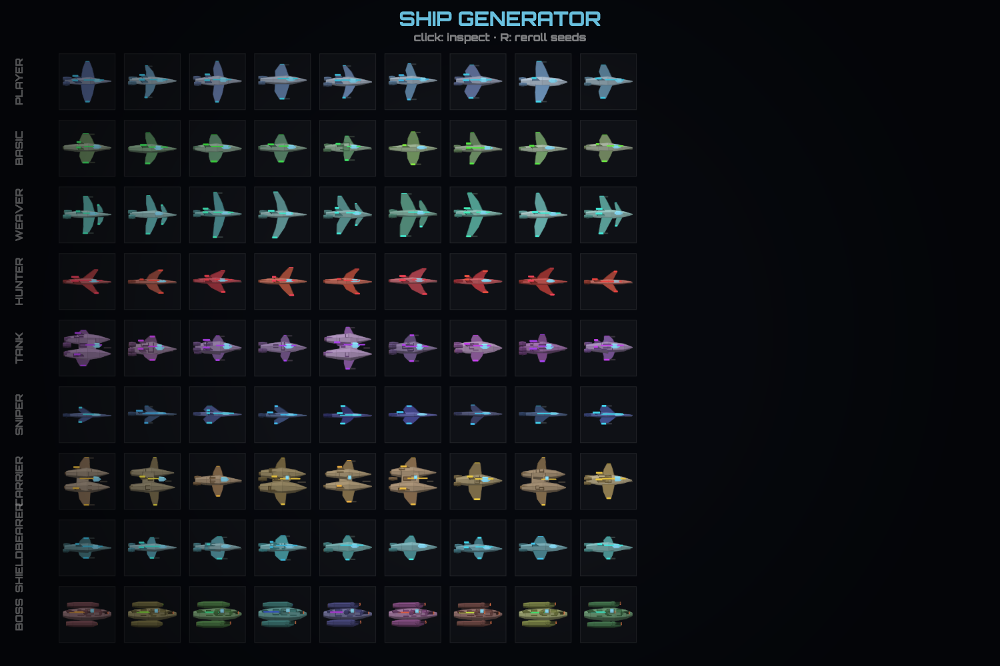

# SPACE VOID

Space shooter for the browser. **All art is generated in code** — ships, bosses, planets, asteroids, explosions, skies, even the menu: the game ships zero image or model files (only sounds are downloaded).

It renders two ways from the same simulation: a **WebGL view** (three.js, loaded on demand) with four cameras — classic top-down, tilted, third-person chase, and a first-person cockpit with live instruments — and the original **classic canvas** look, which is the default on phones, the fallback when WebGL is unavailable, and what the online and versus modes use.

🎮 **Play now: https://space-void.vercel.app** — desktop or phone, installable as a PWA, works offline.

| Gameplay | Menu | Ship generator |
|---|---|---|
|  |  |  |

## Modes

- **SINGLE** — waves, elites, wedge formations, bosses every level, mega boss every 5th
- **LOCAL 2P** — co-op or versus on one keyboard / two gamepads
- **ONLINE** — up to 4 players co-op or 1v1 versus over WebRTC (P2P, host-authoritative)
- **DAILY** — seeded daily challenge with a global leaderboard, one modifier a day (BULLET HELL, MINEFIELD, CONVOY RAID…), 3 attempts

## What's inside

- **WebGL view.** Hand-built hero hulls for the five player ships and ten enemy types, modular bosses with plated, wearing hulls, asteroids that crack apart along fracture cells, baked procedural planets with clouds, rings and moons, a sky that reacts to gunfire, random background events (comet strikes, distant fleet battles, convoys, flares), particles with dynamic lights, bloom, and a cinematic camera rig. Resolution adapts to the GPU.
- **Procedural everything (classic view).** A ~300-line software 3D renderer (`mesh3d.js`) flat-shades low-poly meshes onto the 2D canvas. Ships come from a parts-based generator (hull/wings/fins/engines by family seed), bosses are assembled live from a hull plus turret modules that track players and blow off as health drops, planets/nebulae/backdrops are painted per level, and the hyperspace jump between levels swaps the whole scene at peak streak-speed.
- **Enemy roster:** basic, weaver, hunter, tank (rockets + mines at high levels), sniper (telegraphed rail shot), carrier (launches drones), shieldbearer (own hex bubble), elites (golden aura, guaranteed drop), wedge formations, falling wrecks that stay dangerous.
- **Bosses:** per-level generated dreadnoughts with fan/spiral/ring/wall volleys, aimed shots, homing-rocket salvos, straight and sweeping lasers, minion warps; every 3rd is a carrier, every 4th rams, every 5th is a **two-phase mega boss** whose hull blows away to reveal a rotating-beam core.
- **World:** a stream of unique planets (rings, moons, storms, city lights, orbital stations), comets that sometimes strike them, cargo freighters (a rare golden one rains power-ups when shot down), convoys fleeing pirates, ion storms that knock every weapon offline.
- **Feel:** positional stereo audio (WebAudio synth + panners), 3D debris on every kill, hex shields with impact ripples, combo-heated weapons, slow-mo boss kills, screen-shake, sector names, touch tutorial.

## Controls

**Desktop** — P1: `WASD` move, `Shift` boost, `Space` rocket, `E`/`Q` laser (guns auto-fire). P2 (local): arrows, `RShift`, `Enter`, `Numpad1`/`/`. Gamepads supported (stick/D-pad, `A`/`RT` rocket, `X` laser, `B`/`RB` boost). `Esc`/`P` pause. `V` cycles the camera (top → tilt → third-person chase → cockpit; in chase and cockpit `A`/`D` strafe and `W`/`S` move fore/aft), `G` swaps between the 3D renderer and the classic canvas graphics (offline modes).

**Touch** — drag anywhere to move, on-screen rocket & laser buttons, guns auto-fire.

## Run locally

Static site, no build step:

```bash
cd web
python3 -m http.server 8791
# open http://localhost:8791
```

Online modes need the Vercel API routes (`/api/rtc`, `/api/scores`) — use `vercel dev` for those; everything else works from any static server.

## Dev cheats (URL params)

`?mode=single|coop|versus|daily` skip the menu · `&god` invincible · `&ff=30000` fast-forward 30s · `&boss=N` instant boss of level N · `&ion` ion storm at 5s · `&mod=<id>` force a daily modifier (`minefield`, `rocketday`, `convoy`…) · `&bg=N` force a backdrop seed · `&view=top|tilt|chase|cockpit|classic` force the renderer/camera (no easing) · `&ship=<id>` fly any hull · `&autofire` laser + rockets on a timer · `&bossdie=<ms>` drop the boss to 1 hp at that world time · `&shotat=<ms>` step sim+render to that world time and freeze (deterministic screenshots) · `&screen=hangar|weapons|upgrades|options|scores|local` · `&hud=pause|over` · `&prof` frame-time overlay · `?shipgen` procedural ship gallery (click to inspect, `R` rerolls).

### Headless screenshots

`tools/shot.sh "<url>" out.png [w h virtual_ms]` renders a page in headless Chrome with real WebGL (run the static server first), and `tools/svlog.sh "<url>&log"` prints the event timeline plus any frame errors — together with `&shotat` this is how the 3D view is checked without a browser window:

```bash
tools/shot.sh "http://localhost:8791/?mode=single&god&boss=3&ff=3000&bossdie=7000&shotat=8300&view=chase" boss-death.png
```

`web/dev/*.html` are standalone harnesses for the 3D modules (ships, enemies, hull shader, particles, environment).

## Repo layout

```
web/            the game (deployed to Vercel)
  js/mesh3d.js      software 3D renderer + sprite baking
  js/shipgen.js     parts-based ship generator (all families)
  js/bossgen.js     modular bosses + mega-boss core
  js/bggen.js       planets, backdrops, sector names
  js/procassets.js  builds the whole sprite set at boot
  js/entities.js    everything that moves
  js/view3d.js      WebGL renderer: scene, cameras, post — draws the same sim in 3D
  js/env3d.js       sky, sun, planets, lit fog, lane, weather
  js/fx3d.js        particles, bolts, beams, dynamic lights
  js/rocks3d.js     detailed asteroids + fracture
  js/ships3d.js     hero player hulls · js/hullmat3d.js  plated hull shader
  vendor/           three.js r170 + the few addons used (bloom, composer)
  js/game.js        single/coop/daily world
  js/versus*.js     versus (local + online)
  js/coop_online.js online co-op (host-authoritative snapshots)
  api/              Vercel functions: WebRTC signaling + leaderboards
*.py            the original pygame prototype (legacy, PNG-based)
```

Made by **cRc^** · procedural art & engine built with Claude
